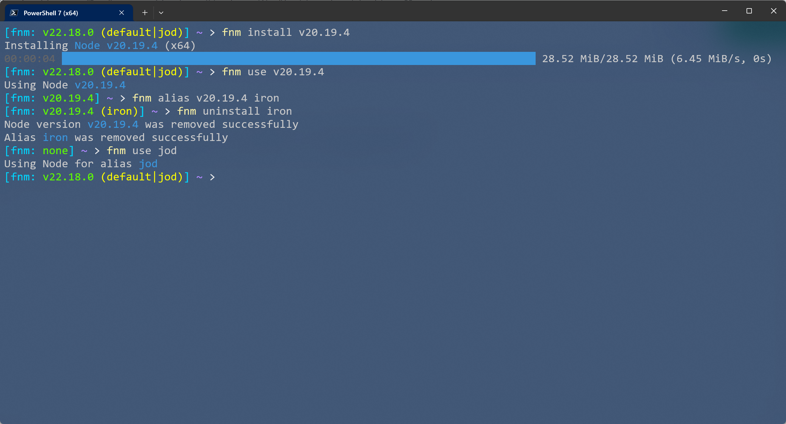

# fnm-pwsh-prompt

## Introduction

This is a config script for PowerShell when you use fnm. It can display the version, the alias clearly in the prompt.

这是一个适用于 [fnm](https://github.com/Schniz/fnm) 的 PowerShell 的配置文件，它可以在提示词中清晰地展示当前版本、别名。

## Preview

## Usage

Append the content of [Microsoft.PowerShell_profile.ps1](./Microsoft.PowerShell_profile.ps1) into the profile of PowerShell.

在 PowerShell 的配置文件中追加 [Microsoft.PowerShell_profile.ps1](./Microsoft.PowerShell_profile.ps1) 中的脚本即可。
