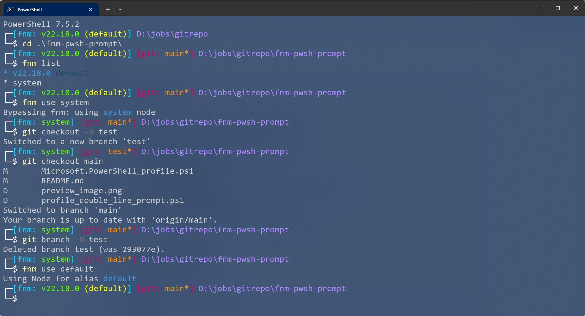

# fnm-pwsh-prompt

[中文](./README.md) | English

## Introduction

This is a configuration file for PowerShell for [fnm](https://github.com/Schniz/fnm) and [git](https://git-scm.com/) that clearly shows the current version and alias of [node.js](https://nodejs.org/zh-cn) and the [git]( https://git-scm.com/) branch information.

At the same time, compared to the default version, this configuration file is a double-bar configuration, which will not shorten the command input space due to too long path names.

## Preview

## Usage

First, open your current PowerShell profile.

Enter `notepad $profile` in PowerShell

Next, append the script from [Microsoft.PowerShell_profile.ps1](./Microsoft.PowerShell_profile.ps1) to the appropriate location in your PowerShell Profile file.